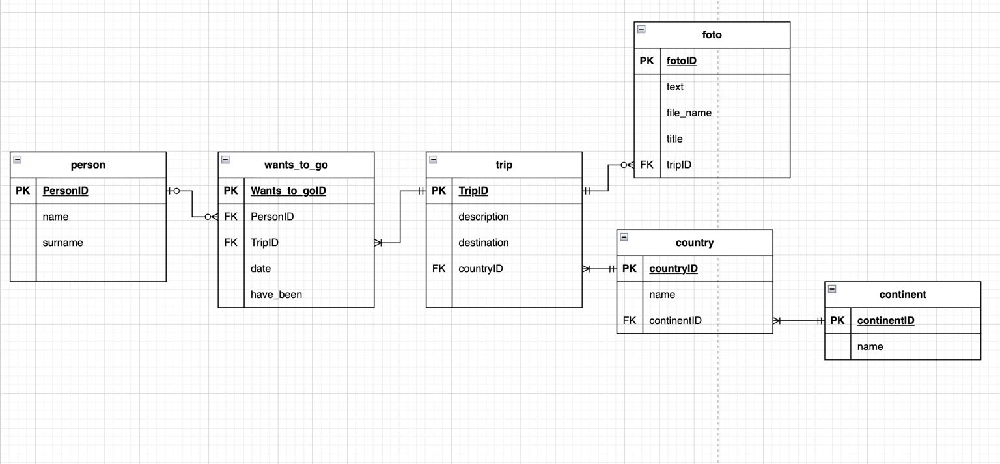

# Trip Planner Web Application – Documentation

## Project Overview

This project is a web application where users can see travel destinations and add new trips.

The application shows trips grouped by continent and country. Users can also see if a destination has already been visited or if it is planned for the future.

The system has:

- a backend built with Node.js and Express
- a database built with SQLite
- a frontend built with HTML, CSS and JavaScript

The frontend communicates with the backend using API requests.

---

# Requirements Specification

## Functional Requirements

The application allows the user to:

### Select a person

The user can choose a person from a dropdown menu.

After selecting a person, the application shows all trips connected to that person.

---

### View trips

Trips are shown this way:

Continent → Country → Destination

The user can:

- click a continent to open countries
- click a country to open destinations

Each destination shows:

- destination name
- description
- travel date
- travel status (visited or planned)
- image (if available)

---

### Add a new trip

The application has a second page where users can add a new trip.

The user can insert all the data regarding the trip and then add it to the database.

---

# Technologies Used

Backend:

- Node.js
- Express

Database:

- SQLite
- better-sqlite3

Frontend:

- HTML
- CSS
- JavaScript

---

# System Architecture

Frontend:

The frontend:

- sends requests to the backend
- displays data received from the backend

Backend:

The backend:

- fetches data from database
- sends results back

Database:

The database stores all travel information.

---

# Database Structure

The database contains these tables:

## person

Stores people.

Fields:

- personID
- name

One person can have many trips.

---

## continent

Stores continents.

Fields:

- continentID
- name

One continent has many countries.

---

## country

Stores countries.

Fields:

- countryID
- name
- continentID

Each country belongs to one continent.

---

## trip

Stores destinations.

Fields:

- tripID
- destination
- description
- countryID

Each trip belongs to one country.

---

## wants_to_go

Connects people and trips.

Fields:

- personID
- tripID
- date
- have_been

This table shows if a person has visited a destination or wants to visit it.

---

## foto

Stores images for trips.

Fields:

- fotoID
- tripID
- file_name
- title

Each image belongs to one trip.

---

# API Endpoints

The backend has API routes used by the frontend.

## GET /api/people_all

Returns all people from the database.

Used to fill the dropdown menu.

---

## GET /api/countries

Returns all countries.

Used in the Add Trip page to select where the new trip is.

---

## GET /api/trips/:personID

Returns all trips and the relative information for the selected person.

Trips are grouped by continent and country.

Example:

"continent": "Europe",
"country": "Italy",
"destination": "Rome",
"description": "Visit city center",
"date": "2026-05-10",
"have_been": 1

---

## POST /api/add_trip

Adds a new trip to the database.

The system saves:

- destination
- description
- country
- date
- travel status

---

# Frontend Structure

The frontend has two main pages.

## index.html

This page allows the user to:

- select a person
- opening the dropdowns of continents and countries see the trips

The trips are shown using JavaScript.

---

## addTrip.html

This page allows the user to:

- select a person
- select a country
- insert trip information
- save a new trip

The page saves the data in the database.
